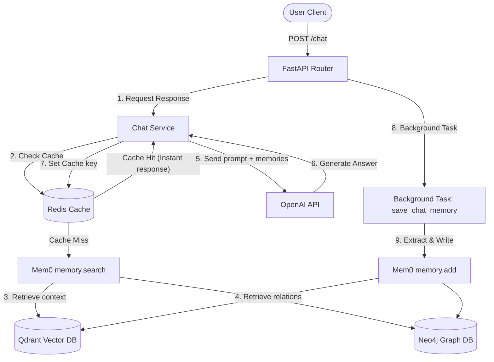

# Project Report: Mem0 Chatbot API

This report outlines the current architecture, data flow, configuration, and technology stack of the **Mem0 Chatbot API** project.

---

## 1. Technology Stack

* **Web Framework:** FastAPI (Uvicorn server)
* **LLM Provider:** OpenAI (`gpt-4o` for chat, `gpt-4o-mini` for memory extraction)
* **Vector Store:** Qdrant (for factual memory storage)
* **Graph Database:** Neo4j (for Graph RAG and entity relationship memory)
* **Cache & Caching GUI:** Redis (for custom API response caching) + Redis Insight (visualization dashboard)
* **Tracing & Observability:** LangSmith

---

## 2. Directory Structure & Key Files

* [`app/main.py`](file:///d:/PROJECT/Python/mem0%20Chatbot/app/main.py): Entrypoint file that configures the FastAPI app, lifespans, and registers routers.
* [`app/routes/router.py`](file:///d:/PROJECT/Python/mem0%20Chatbot/app/routes/router.py): Handles HTTP request/response parsing and endpoint mapping (`/chat`).
* [`app/services/chat_service.py`](file:///d:/PROJECT/Python/mem0%20Chatbot/app/services/chat_service.py): The core business service coordinating LLM completions, Redis caching checks, and memory storage.
* [`app/services/mem0_service.py`](file:///d:/PROJECT/Python/mem0%20Chatbot/app/services/mem0_service.py): Configures and initializes the global Mem0 `Memory` instance (integrating Qdrant and Neo4j).
* [`app/services/hashing.py`](file:///d:/PROJECT/Python/mem0%20Chatbot/app/services/hashing.py): Contains cryptographic hashing helpers for creating consistent Redis cache keys.
* [`docker-compose.yml`](file:///d:/PROJECT/Python/mem0%20Chatbot/docker-compose.yml): Spins up local containers for **Qdrant**, **Redis**, **Redis Insight**, and **Neo4j**.
* [`.env`](file:///d:/PROJECT/Python/mem0%20Chatbot/.env): Environment variables containing API keys, database connection strings, and security keys.

---

## 3. System Architecture Diagram

---

## 4. Key Workflows

### A. Response Generation & Caching (Sync Request Path)
1. Generate a secure, hashed cache key based on the user's query and session ID using **SHA-256** (via `hashing.py`).
2. Search **Redis** for the key:
   * **Cache Hit:** Serve the response instantly (0-10ms).
   * **Cache Miss:** Search Mem0 (Qdrant + Neo4j) for memories, compile the prompt, call OpenAI `gpt-4o`, cache the final answer in Redis for 1 week, and return it to the user.

### B. Memory Storage (Async Background Path)
To prevent blocking response generation, the user's query and the assistant's response are sent to Mem0 in a **FastAPI Background Task**. 
* Mem0 runs its extraction pipeline using the fast `gpt-4o-mini` model.
* Structured facts are stored in **Qdrant**.
* Relationships are stored as nodes and edges in **Neo4j**.

---

## 5. Local Infrastructure Settings

| Service | Port | URL / Protocol | Credentials (if applicable) |
| :--- | :--- | :--- | :--- |
| **FastAPI Backend** | `8000` | `http://localhost:8000` | N/A |
| **Qdrant** | `6333` | `http://localhost:6333` | Secured via `QDRANT__SERVICE__API_KEY` |
| **Redis** | `6379` | `redis://localhost:6379` | No Password |
| **Redis Insight** | `5540` | `http://localhost:5540` | GUI Dashboard |
| **Neo4j** | `7474` (HTTP) / `7687` (Bolt) | `bolt://localhost:7687` | User: `neo4j` / Pass: `password123` |
