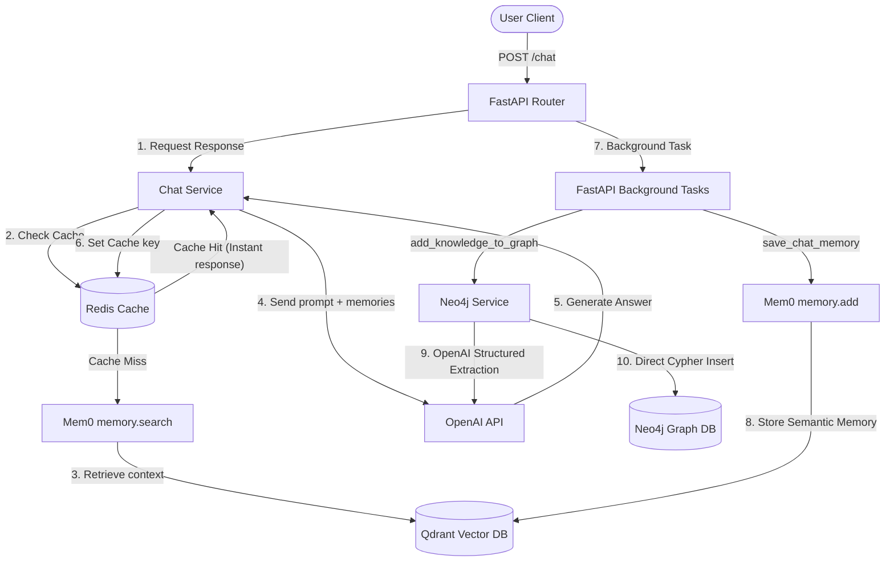

# Project Report: Mem0 Chatbot API

This report outlines the current architecture, data flow, configuration, testing framework, and technology stack of the **Mem0 Chatbot API** project.

---

## 1. Technology Stack

* **Language Runtime:** Python 3.12 (with `uv` package manager)
* **Web Framework:** FastAPI (Uvicorn server)
* **LLM Provider:** OpenAI (`gpt-4o` for chat response generation, `gpt-4o-mini` for memory extraction)
* **Vector Store:** Qdrant (for semantic/factual memory storage managed by Mem0)
* **Graph Database:** Neo4j (direct official Python driver for clean node-relationship knowledge graphs)
* **Cache & Caching GUI:** Redis (API response caching) + Redis Insight (visualization dashboard)
* **Tracing & Observability:** LangSmith
* **Testing Suite:** Pytest + Pytest-Asyncio
* **CI/CD Pipeline:** GitHub Actions

---

## 2. Directory Structure & Key Files

* [`app/main.py`](file:///d:/PROJECT/Python/mem0%20Chatbot/app/main.py): Entrypoint file that configures the FastAPI app, lifespans, and registers routers.
* [`app/routes/router.py`](file:///d:/PROJECT/Python/mem0%20Chatbot/app/routes/router.py): Handles HTTP request/response parsing, endpoint mapping (`/chat`), and schedules background tasks.
* [`app/services/chat_service.py`](file:///d:/PROJECT/Python/mem0%20Chatbot/app/services/chat_service.py): The core business service coordinating LLM completions, Redis caching checks, and semantic memory storage.
* [`app/services/mem0_service.py`](file:///d:/PROJECT/Python/mem0%20Chatbot/app/services/mem0_service.py): Configures and initializes the global Mem0 `Memory` instance (integrating Qdrant).
* [`app/services/neo4j.py`](file:///d:/PROJECT/Python/mem0%20Chatbot/app/services/neo4j.py): Neo4j service module using the native Neo4j driver to extract entities/relationships via AsyncOpenAI structured outputs and save them via Cypher.
* [`app/services/hashing.py`](file:///d:/PROJECT/Python/mem0%20Chatbot/app/services/hashing.py): Contains cryptographic hashing helpers for creating consistent Redis cache keys.
* [`app/schemas/neo4j_schema.py`](file:///d:/PROJECT/Python/mem0%20Chatbot/app/schemas/neo4j_schema.py): Pydantic data schemas (`MemoryFacts`, `Entity`, `Relationship`) used for structured OpenAI extractions.
* [`app/tests/`](file:///d:/PROJECT/Python/mem0%20Chatbot/app/tests/): The automated testing suite containing unit tests, integration database tests, and API validation.
* [`pyproject.toml`](file:///d:/PROJECT/Python/mem0%20Chatbot/pyproject.toml): Centralizes pytest configurations, pythonpath settings, and dependency declarations.
* [`conftest.py`](file:///d:/PROJECT/Python/mem0%20Chatbot/conftest.py): Mocks database initialization side-effects to ensure safe import and test collection in environments without running services (e.g., CI runners).
* [`.github/workflows/ci.yml`](file:///d:/PROJECT/Python/mem0%20Chatbot/.github/workflows/ci.yml): Configures the GitHub Actions CI pipeline to build packages and run tests on code pushes.
* [`docker-compose.yml`](file:///d:/PROJECT/Python/mem0%20Chatbot/docker-compose.yml): Spins up local containers for **Qdrant**, **Redis**, **Redis Insight**, and **Neo4j**.

---

## 3. System Architecture Diagram

---

## 4. Key Workflows

### A. Response Generation & Caching (Sync Request Path)
1. Generate a secure, hashed cache key based on the user's query and session ID using **SHA-256** (via `hashing.py`).
2. Search **Redis** for the key:
   * **Cache Hit:** Serve the response instantly (0-10ms).
   * **Cache Miss:** Search Mem0 (Qdrant) for semantic memories, compile the prompt, call OpenAI `gpt-4o`, cache the final answer in Redis for 1 hour, and return it to the user.

### B. Memory Storage & Graph Extraction (Async Background Path)
To keep client responses fast, memory storage is pushed into **FastAPI Background Tasks** after sending the HTTP response:
1. **Semantic Memory (`save_chat_memory`):** The chat turn is logged with Mem0 to index semantic vectors inside **Qdrant**.
2. **Graph Knowledge (`add_knowledge_to_graph`):** The interaction text is passed to an OpenAI structured output extraction function using your customized Pydantic facts schema. The extracted nodes (entities) and relationships (edges) are committed to **Neo4j** directly using Cypher:
   * Only real entity relationships are created (no redundant document chunk nodes), leaving a clean, readable visual graph.

---

## 5. Testing & CI/CD Setup

We have established a test suite covering three key scopes:
* **Unit Tests (`app/tests/unit_tests/`):** Verify hashing outputs, schema serialization, model logic, and prompt strings. Includes mocks for OpenAI, Redis, and Qdrant clients so they run in milliseconds without requiring external databases.
* **Integration Tests (`app/tests/integration_tests/`):** Test live connections and read/write operations for **Redis** and **Neo4j**.
* **End-to-End API Tests (`app/tests/end_to_end_testing/`):** Run the FastAPI server in-memory using `TestClient` to validate endpoint routing and 422/200 HTTP code responses.
* **CI Actions Pipeline:** A GitHub Actions workflow (`ci.yml`) triggers on pushes to the repository, installing requirements and running the full unit test suite automatically.

---

## 6. Local Infrastructure Settings

| Service | Port | URL / Protocol | Credentials (if applicable) |
| :--- | :--- | :--- | :--- |
| **FastAPI Backend** | `8000` | `http://localhost:8000` | N/A |
| **Qdrant** | `6333` | `http://localhost:6333` | Secured via `QDRANT__SERVICE__API_KEY` |
| **Redis** | `6379` | `redis://localhost:6379` | No Password |
| **Redis Insight** | `5540` | `http://localhost:5540` | GUI Dashboard |
| **Neo4j** | `7474` (HTTP) / `7687` (Bolt) | `bolt://localhost:7687` | User: `neo4j` / Pass: `password123` |
